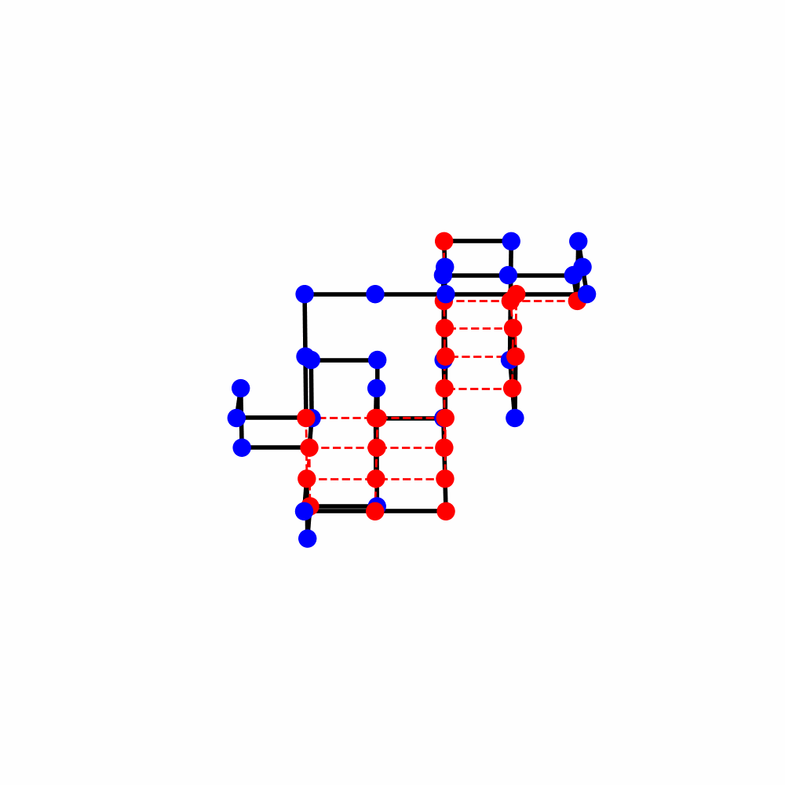

# MinProg-AH

<figure>
    
    <h4></h4>
    <figcaption>A sample 3D protein fold.</figcaption>
</figure>

Even ter veruidelijk van waar alles ligt. Met groepje Amadeus werkte ik in de mainfolder aan een reinforcemenent Q learning algoritme. Die is nog niet af en moet nog aan geprogrammeerd worden. Die kan je vinden in /protein_folding/algorithms/reinforcement.

Ik besefte echter dat het stuctuur iets te overingewikkeld is voor zo een simpele proteine vouwprobleem als deze, dus dat verdiend ook een veel simpelere structuur. Vandaar een nieuw mapje A_new_datastru. 
## Reinforcement Inteligence algorithm

### Algemeen

We beginnen met een sequentie van aminozuren en een startconfiguratie waarbij alle aminozuren op dezelfde lijn liggen.

#### Heuristieken:
Het algoritme maakt gebruik van vijf heuristieken om beslissingen te nemen over hoe de aminozuren moeten worden verplaatst. Deze heuristieken omvatten zaken als het proberen te voorkomen van ongunstige interacties tussen aminozuren, het maximaliseren van compactheid en het volgen van een patroon in de sequentie.

#### Vouwen:
In elke iteratie van het algoritme wordt een aminozuur geselecteerd op basis van de heuristieken, en vervolgens wordt bepaald of het aminozuur met de klok mee of tegen de klok in moet worden verplaatst. Dit wordt gedaan om de configuratie te optimaliseren volgens de heuristieken en de energiematrix.

#### Beloning en Evaluatie:
Nadat een aminozuur is verplaatst, wordt de resulterende configuratie geëvalueerd aan de hand van een beloningsfunctie. Deze functie meet hoe goed de nieuwe configuratie is in termen van energie, waarbij gunstige configuraties lagere energiewaarden hebben.

#### Update:
De algoritme past vervolgens zijn beleid aan op basis van de beloningen die zijn ontvangen. Als een actie positief heeft bijgedragen aan het verminderen van de energie, worden de gewichten van de bijbehorende heuristieken verhoogd. Als een actie negatief heeft bijgedragen, worden de gewichten verlaagd.

#### Herhaling:
Het bovenstaande proces wordt herhaald voor meerdere iteraties of "episodes". Gedurende deze afleveringen wordt geprobeerd om de energie van de configuratie te minimaliseren en zo een optimale vouwing te bereiken.

### Waarom dit algoritme? 
Eenvoudig aan te passen: Het algoritme maakt gebruik van heuristieken en gewichten, waardoor het gemakkelijk kan worden aangepast aan verschillende eiwitten of problemen door de heuristieken en gewichten aan te passen.
Lokale zoekmethode: Het is een lokale zoekmethode, wat betekent dat het probeert de huidige oplossing te verbeteren zonder het gehele zoekruimte te verkennen, wat efficiënt kan zijn voor grote eiwitsequenties.
Flexibiliteit: Het algoritme kan worden aangepast om verschillende doelstellingen en beperkingen in te bouwen, afhankelijk van de specifieke behoeften van het probleem.
Heuristische aanpak: Het maakt gebruik van heuristieken die zijn gebaseerd op intuïtie en kennis van het eiwitten vouwprobleem, wat kan helpen bij het vinden van goede oplossingen.

## Monte-Carlo folding algoritme
te vinden in => A_new_datastru.montecarlo.py
#### algemeen
Invoer Eiwitsequentie: De sequentie van het eiwit wordt voorgesteld als een reeks karakters, waarbij elk karakter een type aminozuur vertegenwoordigt (bijvoorbeeld 'H' voor hydrofoob, 'P' voor polair, 'C' voor een ander type).

Energiematrix: Een energiematrix definieert de interactie-energie tussen paren van aminozuren. Een lagere energie wijst op gunstigere interacties.

Initiële Configuratie: Het eiwit wordt in eerste instantie uitgelegd in een rechte lijn. Elk aminozuur bezet een discrete positie op een 2D-raster.

Energieberekeningsfunctie (calculate_energy): Deze functie berekent de totale energie van een gegeven eiwitconfiguratie op basis van de energiematrix. Het neemt alleen aangrenzende aminozuren in het 2D-raster in overweging.

Validiteitscontrole (is_valid_configuration): Deze functie zorgt ervoor dat geen twee aminozuren dezelfde positie op het raster innemen.

Rotatiefunctie (rotate_segment): Deze functie draait een segment van het eiwit rond een draaipunt. De rotatie kan met de klok mee of tegen de klok in zijn. Dit is hoe het eiwit zijn configuratie verandert tijdens de simulatie.

#### Monte Carlo Vouwalgoritme (monte_carlo_folding):

Het algoritme herhaalt een gespecificeerd aantal keer.

In elke iteratie selecteert het willekeurig een draaipunt en richting om een segment van het eiwit te draaien.

Na de rotatie berekent het de energie van de nieuwe configuratie.

Als de nieuwe configuratie lagere energie heeft, wordt deze geaccepteerd.

Als de nieuwe configuratie hogere energie heeft, kan deze nog steeds worden geaccepteerd met een waarschijnlijkheid die afhangt van de temperatuur 

(die in de loop van de tijd afneemt) en het energieverschil. Dit stelt het algoritme in staat om lokale minima te vermijden.

De beste configuratie (laagste energie) gevonden tijdens de simulatie wordt bijgehouden en opgeslagen.

Visualisatiefuncties (visualize_protein, visualize_in_cmd): Deze functies helpen bij het visualiseren van de eiwitstructuur. visualize_protein gebruikt matplotlib om een grafische plot te maken, terwijl visualize_in_cmd een tekstrepresentatie print.

### WAAROM dit algoritme? 
Exploratie van Complexe Ruimten: Het Monte Carlo-algoritme is effectief in het verkennen van complexe configuratieruimten, zoals bij eiwitvouwen, waar traditionele methoden kunnen vastlopen in lokale minima.

Temperatuurafhankelijke Acceptatie: Door het accepteren van hogere-energie configuraties op basis van een afnemende 'temperatuur', kan het algoritme lokale minima vermijden en naar een globaler minimum zoeken.

### Resultaat 
Sequence : HHPCHHPCCPCPPHHHHPPHCHPHPHCHPP

iteraties: 20000

SimulatedAnealing =  Score: -17: time: 6.3 

iterativegreed = Score: -18; time: 27.30

Monte Carlo = Score: -18; time: 9.78

Run1 : Reinforcement learning: Score: -21  [[0, 0, 'H'], [1, 0, 'H'], [2, 0, 'P'], [2, 1, 'C'], [1, 1, 'H'], [1, 2, 'H'], [1, 3, 'P'], [2, 3, 'C'], [2, 2, 'C'], [3, 2, 'P'], [3, 3, 'C'], [4, 3, 'P'], [5, 3, 'P'], [6, 3, 'H'], [6, 4, 'H'], [6, 5, 'H'], [5, 5, 'H'], [5, 4, 'P'], [4, 4, 'P'], [3, 4, 'H'], [2, 4, 'C'], [1, 4, 'H'], [0, 4, 'P'], [-1, 4, 'H'], [-1, 3, 'P'], [0, 3, 'H'], [0, 2, 'C'], [0, 1, 'H'], [-1, 1, 'P'], [-1, 0, 'P']]

Run 2: Reinforcement learning score: -22 ->: [[0, 0, 'H'], [1, 0, 'H'], [2, 0, 'P'], [2, -1, 'C'], [1, -1, 'H'], [0, -1, 'H'], [0, -2, 'P'], [1, -2, 'C'], [2, -2, 'C'], [2, -3, 'P'], [1, -3, 'C'], [1, -4, 'P'], [1, -5, 'P'], [2, -5, 'H'], [3, -5, 'H'], [4, -5, 'H'], [4, -4, 'H'], [3, 
-4, 'P'], [3, -3, 'P'], [3, -2, 'H'], [3, -1, 'C'], [4, -1, 'H'], [4, -2, 'P'], [4, -3, 'H'], [5, -3, 'P'], [5, -4, 'H'], [5, -5, 'C'], [6, -5, 'H'], [7, -5, 'P'], [8, -5, 'P']]
weights run 2: [-0.22899999999999998, -0.10699999999999998, 8.84000000000054, -0.07, 10.988999999999349]

Run 3: Reinforcement leanring: bestscore: -24 Beststate: [[0, 0, 'H'], [1, 0, 'H'], [1, 1, 'P'], [2, 1, 'C'], [3, 1, 'H'], [4, 1, 'H'], [4, 0, 'P'], [3, 0, 'C'], [2, 0, 'C'], [2, -1, 'P'], [3, -1, 'C'], [3, -2, 'P'], [2, -2, 'P'], [1, -2, 'H'], [1, -1, 'H'], [0, -1, 'H'], [0, -2, 'H'], [0, -3, 'P'], [-1, -3, 'P'], [-1, -2, 'H'], [-1, -1, 'C'], [-1, 0, 'H'], [-1, 1, 'P'], [-1, 2, 'H'], [0, 2, 'P'], [1, 2, 'H'], [2, 2, 'C'], [3, 2, 'H'], [3, 3, 'P'], [4, 3, 'P']]
[-0.26, -0.12, 1.088999999999991, -0.07, 2.0199999999998886]

#### Langere sequence ?
Sequence: PPPHHPPHHPPPPPHHHHHHHPPHHPPPPHHPPHPP

Iterative greedy. Score: -5 ; time: 30.081570625305176 seconds

simulatedAnealing. Score: -9; time: 6.57  

Monte carlo. Score: -11; Time: Unknown but not more then 10 seconds.

Notes/TODO :
sla de bondscore elke iteratie op en plot vervolgnes de bondscore per iteratie. Vergelijk die met andere algoritmes
Convergence met temperatuur visualiseren
Opdrachten: Objective function -> UpperBound Lowerbound; Constraints toevoegen. Minimaal 2.
Introductie - methode - resultaten - discussie - conclusie
Fress
