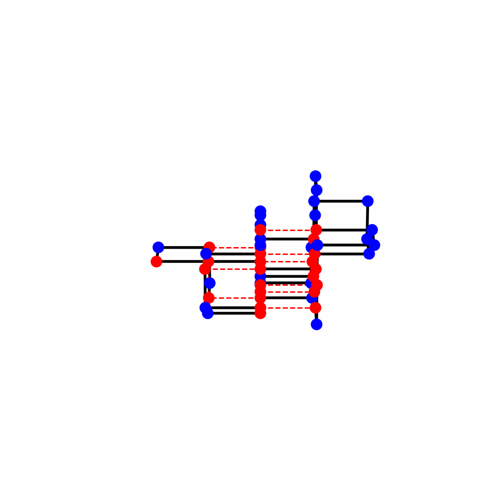

# MinProg-AH

<figure>
    
    <h4></h4>
    <figcaption>A sample 3D protein fold.</figcaption>
</figure>

## How to Use

The Protein Folding Simulator allows you to simulate protein folding using various algorithms. Follow these instructions to get started:

1. **Installation**

   Make sure you have Python installed on your system.

2. **Clone the Repository**

   Clone this repository to your local machine

   Make sure to install the requirements that oyu can find in requirements.txt

You will be prompted to enter an algorithm choice (an integer from 1 to 7) for simulating protein folding.

5. **Choose an Algorithm**

Choose one of the available algorithms by entering the corresponding integer:

- 1: Monte Carlo
- 2: Monte Carlo 3D
- 3: Bruteforce
- 4: Greedy
- 5: Iterative Greedy
- 6: Iterative Random
- 7: Simulated Annealing

6. **Follow the On-Screen Instructions**

Follow the on-screen instructions to input your sequence and algorithm choice.

7. **View Results**

Depending on your algorithm choice, you will see different results and visualizations related to protein folding. The output is for every algorthm different. Make sure to take a look at the code to underrstand what you see. 

8. **Experiment and Explore**

Feel free to explore and experiment with different algorithms.

Have fun simulating protein folding with the Protein Folding Simulator!

## GENERAL
Protein Folding Environment
Protein Sequence: The protein sequence is the linear sequence of amino acids represented by characters such as 'H' (Hydrophobic), 'P' (Polar), and 'C' (Cysteine). This sequence is provided as input to the algorithm.

Energy Matrix: An energy matrix defines the interaction energies between pairs of amino acids. Different pairs may have attractive or repulsive interactions, affecting the overall energy of the protein configuration.

## Algoritms

### Reinforcement Learning Approach for Protein Folding
This is a completely self developed learning-based approach for protein folding. This approach aims to learn a policy that guides the folding process by selecting actions (rotations) for each amino acid in the protein sequence. 

#### Reinforcement Learning Components
##### Policy Weights: The algorithm maintains a set of policy weights, represented as a list. These weights determine the preference for different actions (rotations) based on the estimated rewards.

##### Action Selection: 
The algorithm uses the policy weights to select actions for each amino acid. The action selection process takes into account both the policy weights and a temperature parameter that controls the exploration-exploitation trade-off.

##### Episode:
 An episode in reinforcement learning corresponds to one folding attempt. During each episode, the algorithm aims to improve the folding of the protein.

##### Reward Function:
 The reward function computes the energy of the protein configuration. Lower energy values represent more stable protein conformations, and the goal is to minimize energy.

##### Heuristics: 
Several heuristics are used to estimate the quality of different actions. These heuristics include compactness, folding patterns, and distance measures. The heuristics contribute to the total estimated reward and influence action selection.

##### Learning Rate:
 The learning rate parameter controls how much the policy weights are updated based on the rewards received during the episode.

### Reinforcement Learning Process
#### Initialization:
 The algorithm initializes the state, which represents the current positions of amino acids in the protein sequence, and sets up the policy weights.

#### Episode Execution: 
The algorithm runs multiple episodes (folding attempts). Each episode consists of the following steps:

#### Action Selection:
 For each amino acid, the algorithm selects an action (rotation) based on the current state, policy weights, and temperature. The selected actions may involve clockwise or counterclockwise rotations.

#### State Transition:
 The selected actions are applied to the current state, resulting in a new state. The algorithm computes the reward for this new state based on the energy of the protein configuration.

#### Policy Weight Update:
 The policy weights are updated based on the rewards received during the episode. The update considers the influence of heuristics and the learning rate.

#### Exploration-Exploitation Trade-off: !!!! 
The algorithm balances exploration (trying new actions) and exploitation (selecting actions based on policy weights) using the temperature parameter. As episodes progress, the temperature decreases, making the algorithm more selective in action choices.

##### Randomizing Weights: 
Periodically, the algorithm randomizes the policy weights to introduce exploration and prevent convergence to suboptimal solutions.

### Heuristics 
#### altheuristic: 
Evaluates the hydrophobic to polar ratio within a specified window around a fold index in a protein sequence.

#### currentletter: 
Determines if the amino acid at the fold index is 'P' or 'H', returning a specified score.

#### compactness_heuristic: 
Compares the compactness of the current and next states of a protein structure.

#### folding_heuristic: 
Evaluates the folding propensity based on the amino acid pattern surrounding the fold index.

#### distance_heuristic: 
Calculates the Euclidean distance between the first and last coordinates in the state.

#### hydrophobic_compactness_heuristic:
Measures the compactness of hydrophobic (H) residues in the protein structure.

#### cytosine_compactness_heuristic: 
Measures the compactness of cytosine (C) residues in the protein structure.

#### compactness_heuristic_H: 
Calculates the change in compactness of hydrophobic (H) amino acids between the current and new states.

#### compactness_heuristic_C: 
Calculates the change in compactness of cytosine (C) amino acids between the current and new states.

### MonteCarlo Algoritm

#### Energy Matrix: 
Each pair of amino acids interacts differently. An "energy matrix" defines the energy associated with interactions between different amino acid pairs. For example, some pairs may attract each other (negative energy), while others may repel (positive energy).

#### Energy Calculation: 
To assess a protein's conformation (3D arrangement), we calculate its total energy based on the positions of amino acids and the sequence. The energy considers interactions between pairs of amino acids and their spatial proximity.

#### Configuration Validity Check: 
We ensure that the protein configuration is valid, meaning there are no overlaps or steric clashes between amino acids. Overlapping amino acids would represent an invalid, physically unrealistic structure.

#### Segment Rotation: 
We simulate the folding process by rotating segments of the protein. These segments consist of consecutive amino acids. We can rotate a segment clockwise or counterclockwise to explore different conformations.

#### Monte Carlo Folding:
 We use the Monte Carlo method, which involves repeated random sampling, to simulate the folding process. The simulation is based on a temperature parameter and energy differences. At higher temperatures, the algorithm can accept conformational changes even if they increase energy. As the temperature decreases, the algorithm becomes more selective in accepting higher-energy conformations, leading to stable structures.

#### Visualization:
 To understand the folding progress, we can visualize the protein configuration at different stages. This helps us see how the protein evolves from an extended chain to a compact, stable structure.

#### Bond Score History:
 We track the bond scores (energy) throughout the simulation iterations. This history allows us to observe how the algorithm improves the protein's conformation over time.

## General Algorithms exlainned

### BruteForce

This algorithm attempts to test out every imaginable way of folding a protein. In theory, given an unlimited amount of time, it could eventually find the absolute best configuration. However, in practice, it becomes highly impractical and time-consuming, especially for larger and more complex proteins.

### Iterative Random

Iterates through the protein, examining the potential movement directions for each individual node while taking precautions to avoid any collisions.

### Greedy 

Traverses the protein structure, flexing each node towards the most advantageous orientation determined by its score or, alternatively, selects a random direction when no clear preference exists.

### Greedy Iterative

Iterates through the protein, optimizing node positions by consistently selecting the most advantageous direction based on the score, steadily improving the overall protein configuration.

### Regression

Makes a number of random folds, only keeping the new shape if it has a better score than the previous shape.

### Simulated Annealing

 Resembles the Regression method, with the distinction that there is a gradually diminishing probability, in each iteration, of accepting a new protein shape, even if it happens to be less favorable than the current one.

### Spiral

Arranges the protein in a spiral shape

